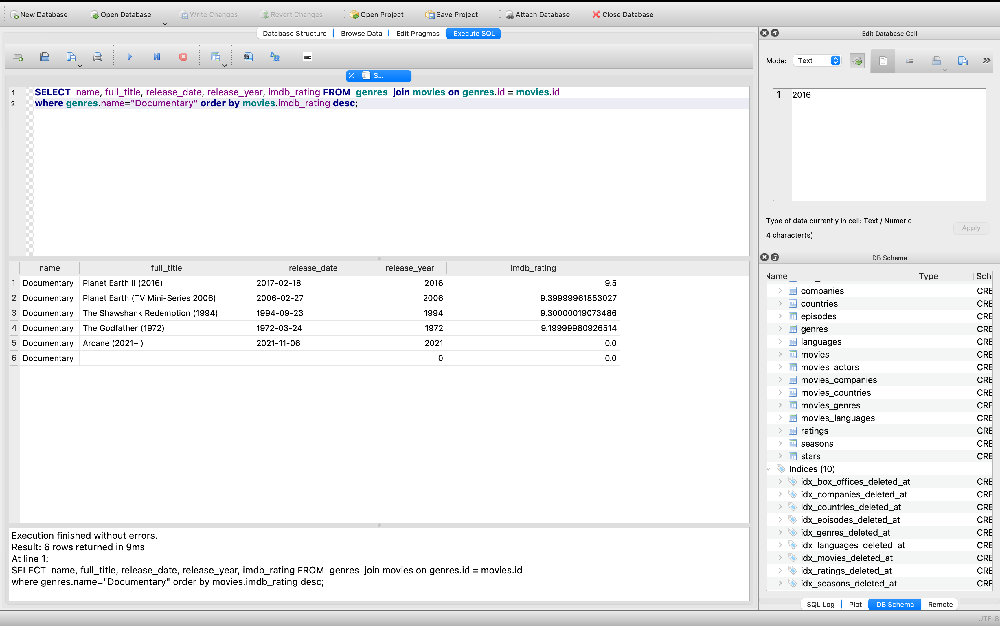
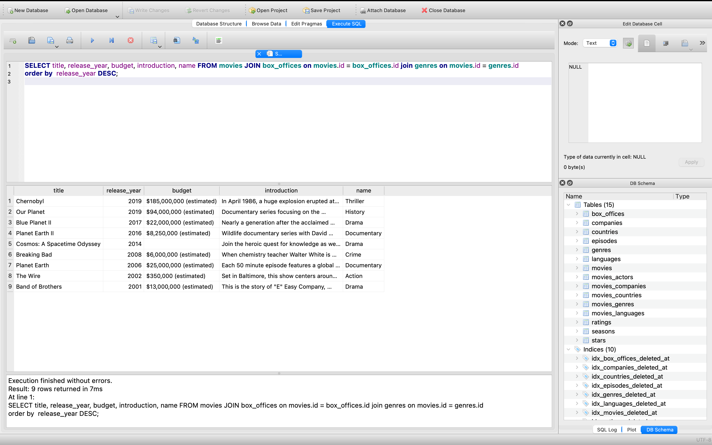
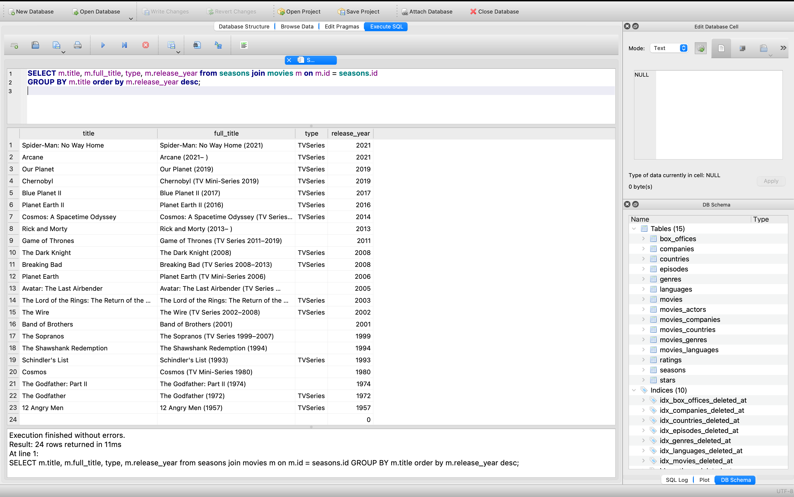
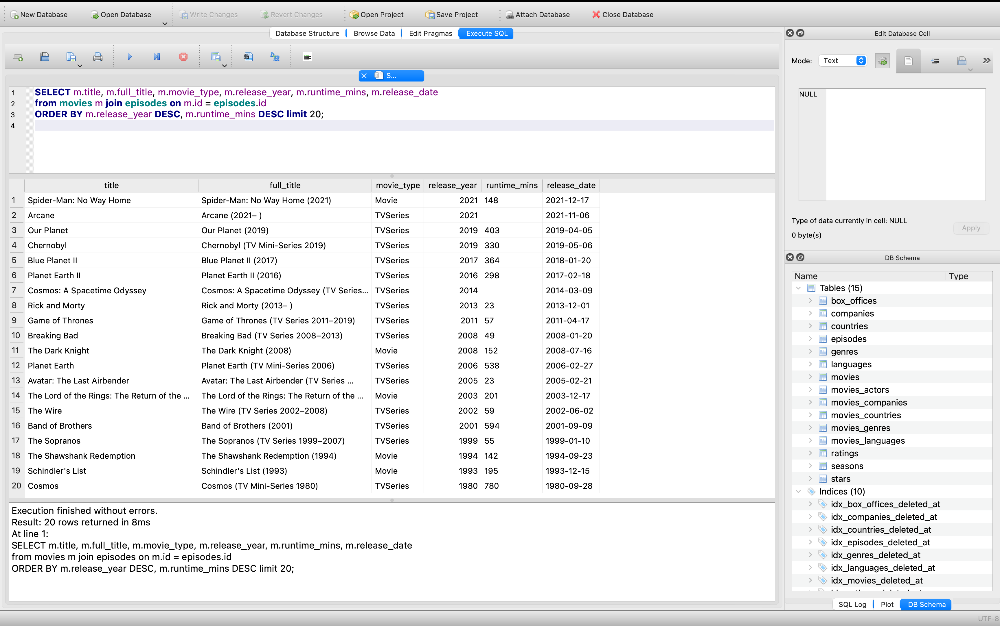
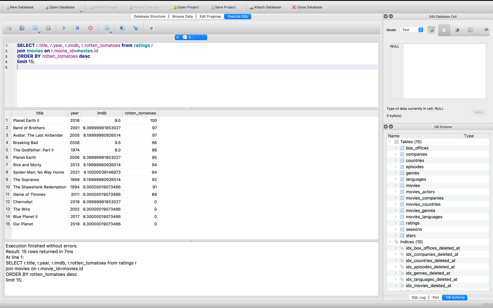
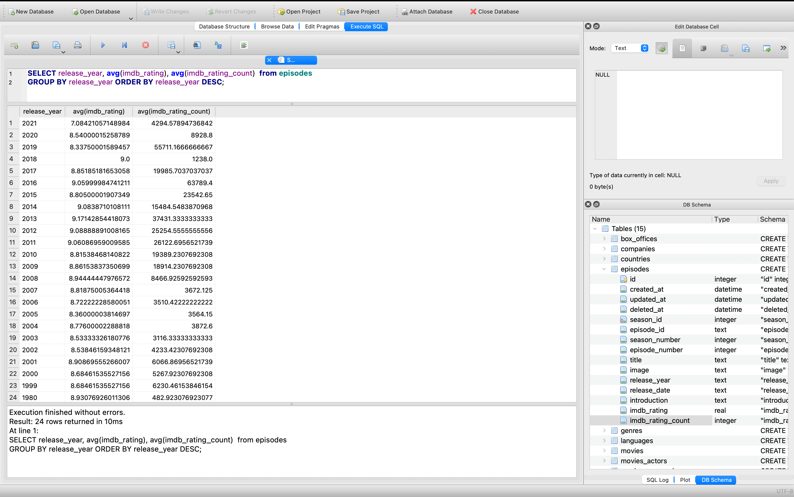
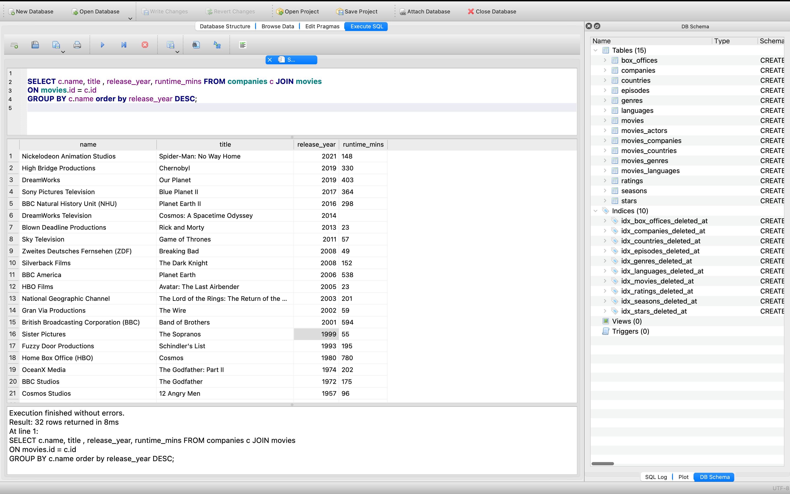
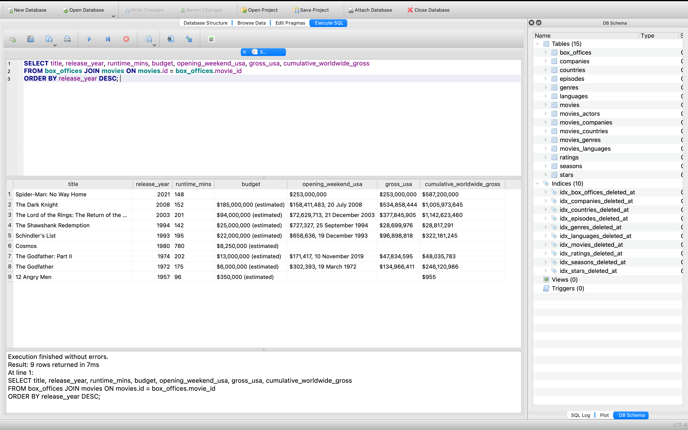
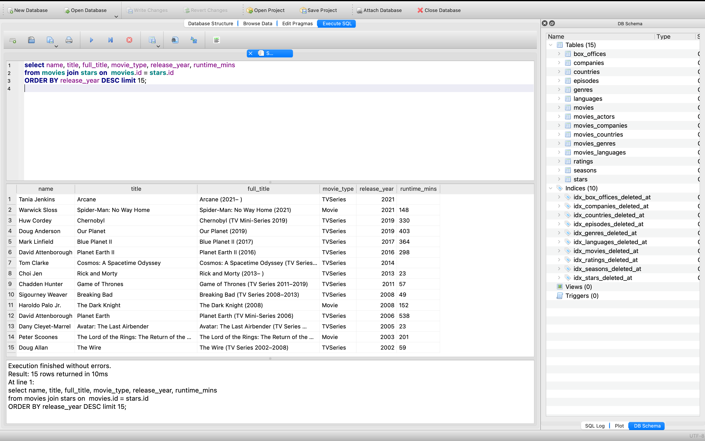
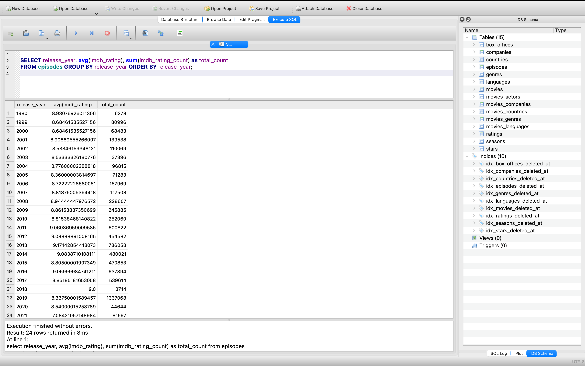

# Queries

This file consists of all the queries made on the IMDB database along with the screenshots of the result.
The operations were performed on SQLite3 Database browser. 

1. Movies and Genre

<code>
    SELECT  name, full_title, release_date, release_year, imdb_rating FROM  genres  join movies on genres.id = movies.id
    where genres.name="Documentary" order by movies.imdb_rating desc;
</code>

 

2. BoxOffice, Movies and Genre

<code>
    SELECT title, release_year, budget, introduction, name FROM movies JOIN box_offices on movies.id = box_offices.id 
    join genres on movies.id = genres.id
    order by  release_year DESC;
</code>

 

3. Seasons and Movies

<code>
    SELECT m.title, m.full_title, type, m.release_year from seasons join movies m on m.id = seasons.id 
    GROUP BY m.title order by m.release_year desc;

</code>

 

4. Movies and Episodes

<code>
    SELECT m.title, m.full_title, m.movie_type, m.release_year, m.runtime_mins, m.release_date 
    from movies m join episodes on m.id = episodes.id 
    ORDER BY m.release_year DESC, m.runtime_mins DESC limit 20;
</code>

 

5. Movies and Ratings

<code>
    SELECT r.title, r.year, r.imdb, r.rotten_tomatoes from ratings r 
    join movies on r.movie_id=movies.id 
    ORDER BY rotten_tomatoes desc 
    limit 15;
</code>

 

6. Episodes with ratings 

<code>
    SELECT release_year, avg(imdb_rating), avg(imdb_rating_count)  from episodes
    GROUP BY release_year ORDER BY release_year DESC;
</code>

 

7. Companies and Movies

<code>
    SELECT c.name, title , release_year, runtime_mins FROM companies c JOIN movies 
    ON movies.id = c.id
    GROUP BY c.name order by release_year DESC;
</code>

 

8. Movies and Box office

<code>
    SELECT title, release_year, runtime_mins, budget, opening_weekend_usa, gross_usa, cumulative_worldwide_gross 
    FROM box_offices JOIN movies ON movies.id = box_offices.movie_id
    ORDER BY release_year DESC; 
</code>

 

9. 

<code>
    SELECT name, title, full_title, movie_type, release_year, runtime_mins 
    FROM movies JOIN stars ON  movies.id = stars.id 
    ORDER BY release_year DESC LIMIT 15;
</code>

 

10. 

<code>
    SELECT release_year, avg(imdb_rating), sum(imdb_rating_count) as total_count FROM episodes GROUP BY release_year ORDER BY release_year;
</code>

 

